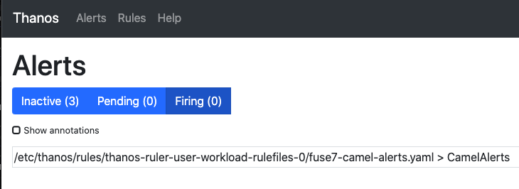

# Instructions for using Prometheus Alerting

OpenShift 4 has built-in support for custom application monitoring and this guide explains how to use it and Prometheus Alerting with Fuse 7.

## Get User Workload Monitoring with your Fuse application

Follow the instructions in the [monitoring guide](prometheus.md] first to get metrics working with your Fuse application.

## Create some alerts

We have an [example alerts file](prometheusalerts.yml) :

```
apiVersion: monitoring.coreos.com/v1
kind: PrometheusRule
metadata:
  name: camel-alerts
  namespace: fuse7
spec:
  groups:
  - name: CamelAlerts
    rules:
    - alert: ExchangesFailed
      expr: org_apache_camel_ExchangesFailed{job="spring-boot-camel"} > 0
      for: 1m
      labels:
        severity: critical
      annotations:
        summary: "{{$labels.job}} exchange failure in context {{$labels.context}}"
        description: "{{$labels.job}} exchange failed - context {{$labels.context}}, namespace {{$labels.namespace}}, processor {{$labels.processor}}"
    - alert: MeanProcessingTimeAboveValueForTenMinutes
      expr: org_apache_camel_MeanProcessingTime{job="spring-boot-camel"} >= 5000
      for: 10m
      labels:
        severity: critical
      annotations:
        summary: "{{$labels.job}} mean processing time was {{ $value }}, above specified value of 5000"
        description: "{{$labels.job}} mean processing time was {{ $value }}, above specified value of 5000"
    - alert: CamelContextDownAfterTenMinutes
      expr: org_apache_camel_StartedRoutes{job="spring-boot-camel"} == 0
      for: 10m
      labels:
        severity: critical
      annotations:
        summary: "{{$labels.job}} has no started routes after ten minutes"
        description: "{{$labels.job}} has {{ $value }} started routes after ten minutes"

```

If you were to use the above example, there are a few things that need to be set.   `job="spring-boot-camel` refers to the Prometheus ServiceMonitor that you created in the first section.   To find what service monitors you've already created in your namespace :

```
$ oc get ServiceMonitor
NAME                AGE
spring-boot-camel   2d1h
```

Edit the file above to use your namespace (change the `namespace:` line) and change the `job=""` to reflect the name of your ServiceMonitor.    Then apply your Prometheus alerts :

```
$ oc create -f prometheusalerts.yml 
prometheusrule.monitoring.coreos.com/camel-alerts created
```


## Using Thanos to view your Alerts

User Workload Monitoring includes the thanos-ruler which gives us a view into the state of your alerts.

Get the route for Thanos from openshift-user-workload-monitoring:

```
$ oc get routes -n openshift-user-workload-monitoring
NAME           HOST/PORT                                                                                  PATH   SERVICES       PORT   TERMINATION          WILDCARD
thanos-ruler   thanos-ruler-openshift-user-workload-monitoring.apps.promtest.local          thanos-ruler   web    reencrypt/Redirect   None
```

Use the route listed and plug it into your browser :



If an alert is triggered, it will move from "inactive" to "pending" until .    If the alert violates the alerting rule long enough for the period specified in `for:` to pass, it will move from pending to firing.

[Prometheus documentation on writing alerting rules](https://prometheus.io/docs/prometheus/latest/configuration/alerting_rules/)

[Configuring alerting receivers](https://www.openshift.com/blog/openshift-4-3-alertmanager-configuration)
